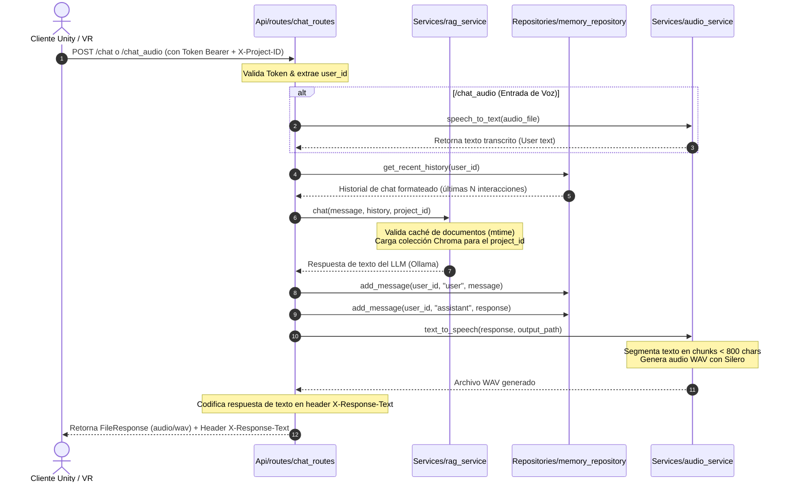
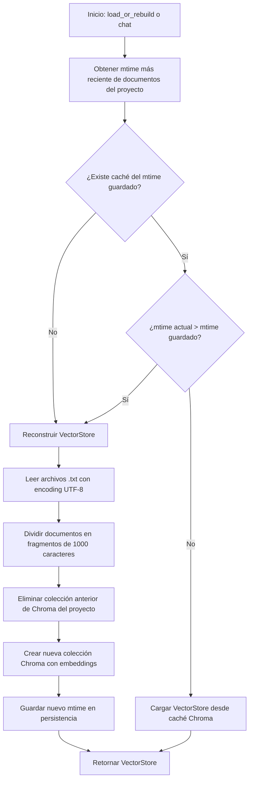

# 🤖 RAG Engine for Unity & VR (Clean Architecture Backend)

Backend de Inteligencia Artificial basado en FastAPI diseñado específicamente para integrarse con simuladores de Realidad Virtual (VR), entornos WebGL o clientes de juego desarrollados en **Unity**. 

Este sistema proporciona capacidades avanzadas de **RAG (Retrieval-Augmented Generation)** con aislamiento por proyectos, procesamiento de voz bidireccional (**STT - Speech to Text** y **TTS - Text to Speech**) optimizado para hardware local, persistencia de partidas, y analíticas detalladas de interacciones estudiantiles.

---

## 🚀 Características Principales

*   **Clean Architecture**: Estructura de software altamente desacoplada en capas (`Api`, `Services`, `Repositories`, `DB`, `Schemas`, `Core`) facilitando el mantenimiento y escalabilidad.
*   **Motor RAG Multi-Proyecto Aislado**: Soporte para colecciones independientes en la base de datos vectorial (ChromaDB) asociadas a identificadores de proyecto (`X-Project-ID`).
*   **Caché Inteligente de Documentos**: El sistema lee los tiempos de modificación (`mtime`) de los archivos de texto del proyecto y reconstruye las colecciones vectoriales únicamente cuando se detectan cambios físicos.
*   **Pipeline de Audio Bidireccional Local**:
    *   **STT (Transcripción)**: Incorpora `faster-whisper` (modelo `tiny` por defecto ejecutado en CPU) para procesar grabaciones de voz del usuario con baja latencia.
    *   **TTS (Síntesis)**: Utiliza el motor neuronal `Silero TTS` (modelo `v3_es` en español) para responder con archivos de audio WAV realistas.
    *   **Segmentación Inteligente**: Divide textos largos en fragmentos menores a 800 caracteres para evitar fallos de memoria en el motor Silero.
*   **Sistema de Audio Resiliente (Fallback)**: Si el servidor carece de hardware compatible (por ejemplo, dependencias de PyTorch o modelos de audio no instalados), se activa automáticamente un motor de respaldo que genera archivos de audio WAV con silencios de 0.5s de forma nativa. Esto permite que el flujo de chat de texto en Unity continúe funcionando sin interrupciones ni bloqueos de red.
*   **Persistencia de Partidas en la Nube (Save System)**: Los clientes Unity pueden codificar su estado de juego en Base64 y guardarlo de forma segura en un campo BLOB de SQLite.
*   **Métricas de Aprendizaje (Student Analytics)**: Registro estructurado de acciones de estudiantes para paneles educativos o de supervisión docente.
*   **Seguridad por Tokens Firmados**: Autenticación criptográfica (HMAC-SHA256) sin estado (stateless) que incrusta de forma segura el ID de usuario y la fecha de expiración.

---

## 📂 Estructura del Proyecto

A continuación se detalla la distribución de carpetas y archivos bajo la filosofía de Clean Architecture:

```text
├── chroma_db/                  # Almacenamiento persistente de Chroma (vectores y embeddings)
├── documentos/                 # Directorio raíz para fuentes de conocimiento RAG (.txt)
│   ├── default/                # Documentos por defecto del proyecto "default"
│   │   └── oop_expert_personality.txt  # Ejemplo: Archivo de contexto POO
│   └── [project_id]/           # Subcarpetas con documentos específicos de otros proyectos
├── sqlite_db/                  # Directorio para la base de datos SQLite (Usuarios, Historial, Saves, Logs)
├── docker-compose.yml          # Orquestación de contenedores (FastAPI RAG + Ollama + Open WebUI)
├── test.json                   # Plantilla de ejemplo para pruebas locales de peticiones
└── rag_app/                    # Código fuente del Backend FastAPI
    ├── Dockerfile              # Dockerfile optimizado para construir el backend RAG
    ├── main.py                 # Punto de entrada de la aplicación FastAPI y middleware CORS
    ├── requirements.txt        # Dependencias de Python del backend
    ├── Api/                    # Capa de API y Controladores
    │   └── routes/             # Endpoints HTTP organizados por lógica
    │       ├── analytics_routes.py  # Registro y visualización de analíticas de estudiantes
    │       ├── auth_routes.py       # Endpoints de Registro y Login
    │       ├── chat_routes.py       # Procesamiento RAG de texto, carga de audios y recarga de docs
    │       └── save_routes.py       # Guardado y carga de progreso de partidas
    ├── Core/                   # Capa del Núcleo y Configuraciones Globales
    │   ├── config.py           # Variables de entorno y rutas absolutas portables
    │   └── security.py         # Hasheo de contraseñas (bcrypt) y tokens HMAC
    ├── DB/                     # Capa de Infraestructura de Base de Datos
    │   └── sqlite_client.py    # Conexión SQLite, configuración WAL y creación de tablas
    ├── Repositories/           # Capa de Acceso a Datos (DAOs)
    │   ├── analytics_repository.py  # CRUD de interacciones estudiantiles
    │   ├── auth_repository.py       # Operaciones de lectura y escritura de usuarios
    │   ├── memory_repository.py     # Gestión de historial de chat de base de datos
    │   └── save_repository.py       # Inserción con resolución de conflictos (Upsert) de partidas
    ├── Schemas/                # Validadores de Petición y Respuesta (Pydantic Models)
    │   ├── analytics_schema.py      # Estructuras para analíticas
    │   ├── auth_schema.py           # Estructuras de login, registro y tokens
    │   ├── chat_schema.py           # Formatos de entrada y salida del chat
    │   └── save_schema.py           # Estructuras del Save System (Base64 wrapper)
    └── Services/               # Capa de Lógica de Negocio
        ├── audio_service.py         # Motor de audio principal (faster-whisper STT + Silero TTS)
        ├── audio_service_fallback.py# Motor secundario nativo (Genera WAV de silencio de 0.5s)
        ├── auth_service.py          # Lógica de registro y validación de credenciales
        ├── rag_service.py           # Lógica RAG (LangChain + ChromaDB + Ollama)
        └── save_service.py          # Lógica para codificar y decodificar saves de base64 a binario
```

---

## ⚙️ Mecanismos de Funcionamiento

### 1. Flujo de Procesamiento del Chat (Audio y Texto)

Cuando un estudiante habla o escribe desde Unity, el backend procesa los datos en secuencia a través de las diferentes capas del backend:



### 2. Mecanismo de Caché Dinámica RAG y Aislamiento de Proyectos
El motor RAG no recarga los archivos de texto en cada consulta. En su lugar, realiza un control de versiones basado en la fecha de modificación física (`mtime`) del directorio del proyecto:



*   **Aislamiento por cabecera**: El servidor lee la cabecera `X-Project-ID` de la petición HTTP. Si no se provee, asume `"default"`.
*   **Nombre de Colección**: Se mapea a `project_{project_id}` en Chroma DB.
*   **Personalidad Dinámica**: El prompt RAG obliga al modelo de lenguaje a adoptar de forma estricta las directrices de personalidad indicadas en los documentos e impide alucinaciones limitando la respuesta al contexto provisto.

---

## 🛠️ Desarrollo y Configuración del Entorno

### Requisitos Previos

*   **Docker** y **Docker Compose** instalados.
*   **Ollama** ejecutándose localmente o en un contenedor.
*   (Opcional) Si se corre sin Docker, **Python 3.10** y las dependencias de `requirements.txt`.

### Ejecución con Docker Compose (Recomendado)

El archivo `docker-compose.yml` inicia automáticamente Ollama, Open-WebUI para interactuar visualmente con el LLM, y la API de RAG enlazando los volúmenes de documentos y bases de datos.

1.  **Iniciar servicios**:
    ```bash
    docker-compose up --build -d
    ```
2.  **Verificar estado**:
    ```bash
    docker-compose ps
    ```
3.  **Descargar el modelo en Ollama**:
    Si es la primera vez que se ejecuta, debes descargar el modelo de lenguaje de Ollama (por ejemplo, `llama3`):
    ```bash
    docker exec -it ollama ollama run llama3
    ```

El backend RAG estará disponible en `http://localhost:8000`.

### Ejecución Local en Windows (Modo Desarrollo)

1.  **Instalar dependencias**:
    ```powershell
    pip install -r rag_app/requirements.txt
    ```
2.  **Iniciar el servidor**:
    ```powershell
    cd rag_app
    uvicorn main:app --reload --host 0.0.0.0 --port 8000
    ```

> [!NOTE]
> Al iniciar en modo desarrollo local, si no tienes instalados programas de compilación de C++ para construir los módulos nativos de Python, o si te falta GPU, `AudioService` lanzará una advertencia y recurrirá automáticamente al `FallbackAudioService`. El sistema seguirá funcionando completamente mediante chat y retornará archivos de audio de silencio válidos para no bloquear Unity.

---

## 🔌 Referencia de Endpoints API

Todas las peticiones a endpoints protegidos requieren el encabezado:
`Authorization: Bearer <TOKEN_DE_SESION>`

Para enviar consultas de un proyecto específico, se debe incluir la cabecera:
`X-Project-ID: <identificador_de_proyecto>` (por ejemplo, `X-Project-ID: default` o `X-Project-ID: vr_class_01`).

### 🔑 Autenticación

#### 1. Registrar un nuevo usuario
*   **Ruta**: `POST /register`
*   **Cuerpo (JSON)**:
    ```json
    {
      "username": "estudiante_vr",
      "password": "mi_password_segura"
    }
    ```
*   **Respuesta Exitosa**:
    ```json
    {
      "message": "Registro completado con éxito.",
      "user_id": 1
    }
    ```

#### 2. Iniciar sesión (Login)
*   **Ruta**: `POST /login`
*   **Cuerpo (JSON)**:
    ```json
    {
      "username": "estudiante_vr",
      "password": "mi_password_segura"
    }
    ```
*   **Respuesta Exitosa**:
    ```json
    {
      "access_token": "1:1784102400:8f6d2e9c1...",
      "token_type": "Bearer"
    }
    ```

---

### 💬 Chat e Inferencia IA

#### 1. Enviar pregunta por texto
*   **Ruta**: `POST /chat`
*   **Cabeceras**: `X-Project-ID: default`
*   **Cuerpo (JSON)**:
    ```json
    {
      "message": "¿Cuáles son los cuatro pilares fundamentales de la POO?"
    }
    ```
*   **Respuesta**: Devuelve un flujo de bytes binario de audio (`audio/wav`) con la respuesta hablada. La respuesta en texto transcrita viene codificada en formato URL dentro del encabezado de respuesta HTTP `X-Response-Text`.

#### 2. Enviar pregunta por audio (Voz)
*   **Ruta**: `POST /chat_audio`
*   **Cuerpo (Multipart Form)**:
    *   `audio_file`: Archivo binario `.wav` grabado desde el micrófono.
*   **Respuesta**: Devuelve un flujo de bytes binario de audio (`audio/wav`) correspondiente a la respuesta TTS del bot. La respuesta en texto transcrita por la IA viene codificada en el encabezado de respuesta HTTP `X-Response-Text`.

#### 3. Recargar documentos RAG manualmente
*   **Ruta**: `POST /reload_docs`
*   **Respuesta**:
    ```json
    {
      "response": "Documentos recargados explícitamente para el proyecto 'default'.",
      "status": "success"
    }
    ```

---

### 💾 Sistema de Guardado (Save System)

Permite persistir estados serializados de Unity de manera segura en formato binario (utilizando Base64 como transporte).

#### 1. Guardar estado de partida
*   **Ruta**: `POST /save`
*   **Cuerpo (JSON)**:
    ```json
    {
      "save_data_base64": "eyJwYW5lX2FjdGl2byI6MiwicG9zaXRpb24iOlsxLjIsMC41LC0zLjRdfQ=="
    }
    ```
*   **Respuesta**:
    ```json
    {
      "message": "Partida guardada exitosamente"
    }
    ```

#### 2. Cargar estado de partida
*   **Ruta**: `GET /save`
*   **Respuesta**:
    ```json
    {
      "save_data_base64": "eyJwYW5lX2FjdGl2byI6MiwicG9zaXRpb24iOlsxLjIsMC41LC0zLjRdfQ==",
      "message": "Partida cargada exitosamente"
    }
    ```

---

### 📊 Analíticas de Estudiantes

#### 1. Registrar un evento o acción
*   **Ruta**: `POST /analytics/log`
*   **Cuerpo (JSON)**:
    ```json
    {
      "activity_type": "vr_lever_interaction",
      "details": "El estudiante activó la palanca de presión en la secuencia incorrecta (Paso 3 omitido)"
    }
    ```
*   **Respuesta**:
    ```json
    {
      "status": "success",
      "message": "Actividad registrada con éxito",
      "activity_id": 12
    }
    ```

#### 2. Consultar mis registros (Estudiante)
*   **Ruta**: `GET /analytics/my-logs`
*   **Respuesta**: Una lista JSON con los eventos ordenados cronológicamente desde el más reciente.

#### 3. Consultar registros del proyecto (Docente / Dashboard)
*   **Ruta**: `GET /analytics/project-logs`
*   **Cabeceras**: `X-Project-ID: default`
*   **Respuesta**: Retorna todas las interacciones registradas para ese ID de proyecto por todos los estudiantes.

---

## 🎮 Integración con Unity (WebGL / Standalone)

Para consumir este backend desde Unity, se recomienda usar `UnityWebRequest`. A continuación, se presentan recomendaciones clave de integración:

### 1. Gestión de Sesión
Tras hacer login (`POST /login`), guarda la cadena de `access_token` en memoria. Adjúntala en tus peticiones subsecuentes agregando la cabecera:
`request.SetRequestHeader("Authorization", "Bearer " + token);`

### 2. Recepción de Audio y Texto en una sola petición
Los endpoints de chat devuelven un archivo `.wav` directamente en el cuerpo de la respuesta HTTP. Para reproducirlo:
1.  Usa `DownloadHandlerAudioClip` en Unity para capturar el flujo de audio.
2.  Para obtener la respuesta textual generada y mostrarla en subtítulos, lee el encabezado HTTP personalizado `X-Response-Text`:
    ```csharp
    string rawTextHeader = request.GetResponseHeader("X-Response-Text");
    string clearText = UnityEngine.Networking.UnityWebRequest.UnEscapeURL(rawTextHeader);
    ```

### 3. Evitar problemas de CORS en Navegadores (WebGL)
El servidor FastAPI está preconfigurado con políticas CORS permisivas (`allow_origins=["*"]`) pero con `allow_credentials=False` debido a las restricciones de los navegadores cuando se usan comodines. Las cabeceras como `X-Project-ID` y `Authorization` están explícitamente expuestas y permitidas para que Unity WebGL no sufra bloqueos de red preflight (peticiones `OPTIONS`).
